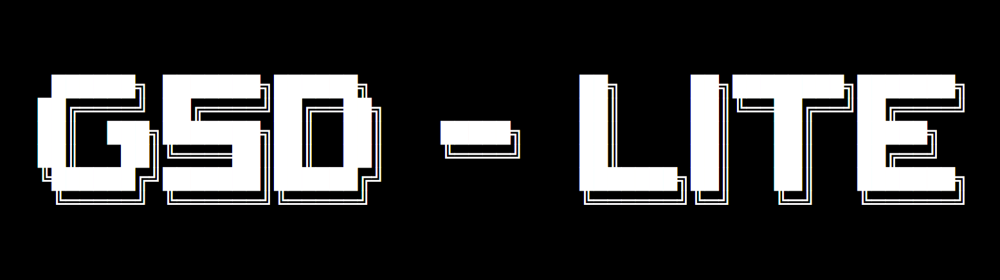

# Get Shit Done (Lite)

**A meta-prompting, context engineering, and spec-driven development system for Claude Code, originally by [TACHES](https://github.com/glittercowboy/get-shit-done).**

THIS is how you vibecode and actually get shit done.

---

## What Makes Get Shit Done Lite (GSDL) Different

GSDL is a lean fork of GSD that stays fast for smaller projects.

1. We forked GSD v1.3.9 before the system grew heavy for our typical project sizes.
2. We optimized token usage without degrading output quality.
3. We added an automated frontend review step using Playwright MCP (install required).

---

## Quick Start (New Projects)

### 1) Start with an idea

```
/gsd:new-project
```

### 2) Create a roadmap

```
/gsd:create-roadmap
```

### 3) Plan phases

```
/gsd:plan-phase 1
```

### 4) Execute phases

```
/gsd:execute-plan
```

### 5) Add phases

```
/gsd:add-phase
```

### 6) Complete milestones

```
/gsd:complete-milestone
```

---

## Quick Start (Existing Projects)

Already have code? Start here.

### 1) Map the codebase

```
/gsd:map-codebase
```

### 2) Initialize the project

```
/gsd:new-project
```

### 3) Continue as normal

```
/gsd:create-roadmap -> /gsd:plan-phase -> /gsd:execute-plan
```

The codebase docs load automatically during planning, so Claude follows your patterns.

---

## Token Efficiency Updates

We optimized default context loading to reduce token usage without removing guidance.

What changed:

- Split heavy references into "core" versions used by default.
- Keep full reference docs available for examples and deep guidance.
- Load provider-specific automation docs only when a phase needs them.
- Require Playwright verification for user-visible UI changes.

Estimated impact (default command context only, excluding project files):

- `/gsd:plan-phase`: ~15.9k tokens -> ~11.1k tokens (about 30% reduction)
- `/gsd:execute-plan`: ~10.8k tokens -> ~8.5k tokens (about 22% reduction)

Quality is preserved because full references are still available and loaded when needed.

---

## Why It Works

### Context Engineering

Claude Code is incredibly powerful if you give it the context it needs. GSDL does that for you:

| File         | What it does                                      |
| ------------ | ------------------------------------------------- |
| `PROJECT.md` | Project vision, always loaded                     |
| `ROADMAP.md` | Where you are going, what is done                 |
| `STATE.md`   | Decisions, blockers, memory across sessions       |
| `PLAN.md`    | Atomic tasks with XML structure and verification  |
| `SUMMARY.md` | What happened, what changed, committed to history |
| `ISSUES.md`  | Deferred enhancements tracked across sessions     |

### XML Prompt Formatting

Plans are structured XML optimized for Claude:

```xml
<task type="auto">
  <name>Create login endpoint</name>
  <files>src/app/api/auth/login/route.ts</files>
  <action>
    Use jose for JWT (not jsonwebtoken - CommonJS issues).
    Validate credentials against users table.
    Return httpOnly cookie on success.
  </action>
  <verify>curl -X POST localhost:3000/api/auth/login returns 200 + Set-Cookie</verify>
  <done>Valid credentials return cookie, invalid return 401</done>
</task>
```

### Subagent Execution

As context grows, quality drops. GSDL prevents this by keeping each plan to a maximum of three tasks and running each task in a fresh subagent:

- Task 1: fresh context, full quality
- Task 2: fresh context, full quality
- Task 3: fresh context, full quality

No degradation. Walk away, come back to completed work.

### Clean Git History

Each task is an atomic commit with a clear message and summary, so you can trace exactly what changed.

### Modular by Design

- Add phases to a milestone
- Insert urgent work between phases
- Complete milestones and start fresh
- Adjust plans without rebuilding everything

You are never locked in. The system adapts.

---

## Commands

| Command                           | What it does                                            |
| --------------------------------- | ------------------------------------------------------- |
| `/gsd:new-project`                | Extract your idea through questions, create PROJECT.md  |
| `/gsd:create-roadmap`             | Create roadmap and state tracking                       |
| `/gsd:map-codebase`               | Map existing codebase for brownfield projects           |
| `/gsd:plan-phase [N]`             | Generate task plans for a phase                         |
| `/gsd:execute-plan`               | Run plan via subagent                                   |
| `/gsd:progress`                   | Where am I? What is next?                               |
| `/gsd:complete-milestone`         | Ship it, prep next version                              |
| `/gsd:discuss-milestone`          | Gather context for next milestone                       |
| `/gsd:new-milestone [name]`       | Create new milestone with phases                        |
| `/gsd:add-phase`                  | Append a phase to the roadmap                           |
| `/gsd:insert-phase [N]`           | Insert urgent work                                      |
| `/gsd:discuss-phase [N]`          | Gather context before planning                          |
| `/gsd:research-phase [N]`         | Deep ecosystem research for niche domains               |
| `/gsd:list-phase-assumptions [N]` | See what Claude thinks before you correct it            |
| `/gsd:pause-work`                 | Create a handoff file when stopping mid-phase           |
| `/gsd:resume-work`                | Restore from the last session                           |
| `/gsd:consider-issues`            | Review deferred issues, close resolved, identify urgent |
| `/gsd:help`                       | Show all commands and usage guide                       |

---

## Who This Is For

People who want to vibecode and have it actually work.

Anyone who wants to clearly describe what they want, trust the system to build it, and go live their life.

Not for people who enjoy inconsistent and sloppy results.

---

## License

MIT License. See [LICENSE](LICENSE) for details.

---

**Claude Code is powerful. GSDL gives it the context and the systematic consistency to prove it.**


